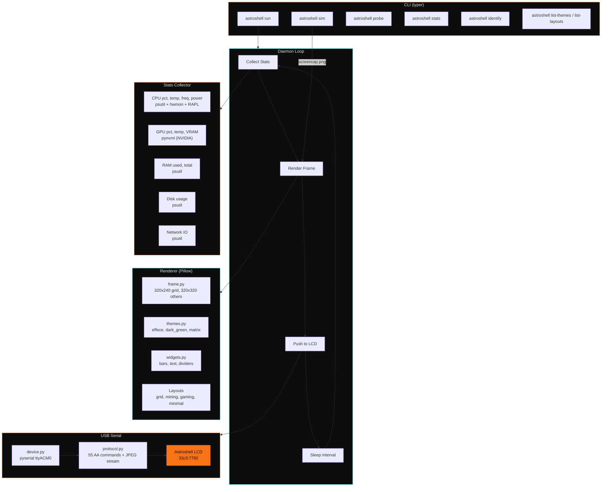

# System Architecture

```mermaid
graph TD
    subgraph CLI["CLI (typer)"]
        RUN["astroshell run"]
        SIM["astroshell sim"]
        PROBE["astroshell probe"]
        STATS["astroshell stats"]
        IDENT["astroshell identify"]
        LIST["astroshell list-themes / list-layouts"]
    end

    subgraph DAEMON["Daemon Loop"]
        COLLECT["Collect Stats"]
        RENDER["Render Frame"]
        PUSH["Push to LCD"]
        SLEEP["Sleep interval"]
        COLLECT --> RENDER --> PUSH --> SLEEP --> COLLECT
    end

    subgraph STATS_LAYER["Stats Collector"]
        CPU["CPU pct, temp, freq, power<br/>psutil + hwmon + RAPL"]
        GPU["GPU pct, temp, VRAM<br/>pynvml (NVIDIA)"]
        RAM["RAM used, total<br/>psutil"]
        DISK["Disk usage<br/>psutil"]
        NET["Network IO<br/>psutil"]
    end

    subgraph RENDERER["Renderer (Pillow)"]
        FRAME["frame.py<br/>320x240 grid, 320x320 others"]
        THEMES["themes.py<br/>effece, dark_green, matrix"]
        WIDGETS["widgets.py<br/>bars, text, dividers"]
        LAYOUTS["Layouts<br/>grid, mining, gaming, minimal"]
    end

    subgraph USB["USB Serial"]
        DEVICE["device.py<br/>pyserial ttyACM0"]
        PROTO["protocol.py<br/>55 AA commands + JPEG stream"]
        LCD["Astroshell LCD<br/>33c3:7792"]
    end

    RUN --> DAEMON
    SIM -->|screencap.png| RENDER
    COLLECT --> STATS_LAYER
    RENDER --> RENDERER
    PUSH --> USB
    DEVICE --> PROTO --> LCD

    style CLI fill:#0d0d0d,stroke:#f97316,color:#e5e5e5
    style DAEMON fill:#0d0d0d,stroke:#22d3ee,color:#e5e5e5
    style STATS_LAYER fill:#0d0d0d,stroke:#f97316,color:#e5e5e5
    style RENDERER fill:#0d0d0d,stroke:#22d3ee,color:#e5e5e5
    style USB fill:#0d0d0d,stroke:#f97316,color:#e5e5e5
    style LCD fill:#f97316,stroke:#f97316,color:#0d0d0d
```
