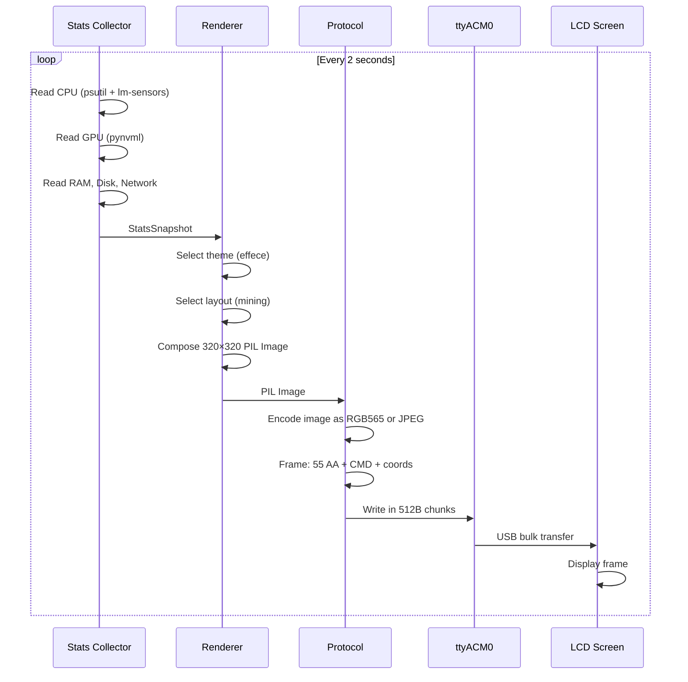

# Data Pipeline

```mermaid
sequenceDiagram
    participant S as Stats Collector
    participant R as Renderer
    participant P as Protocol
    participant D as ttyACM0
    participant L as LCD Screen

    loop Every 2 seconds
        S->>S: Read CPU (psutil + lm-sensors)
        S->>S: Read GPU (pynvml)
        S->>S: Read RAM, Disk, Network
        S->>R: StatsSnapshot

        R->>R: Select theme (effece)
        R->>R: Select layout (mining)
        R->>R: Compose 320×320 PIL Image
        R->>P: PIL Image

        P->>P: Encode image as RGB565 or JPEG
        P->>P: Frame: 55 AA + CMD + coords
        P->>D: Write in 512B chunks

        D->>L: USB bulk transfer
        L->>L: Display frame
    end
```
