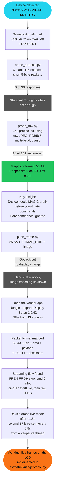

# Protocol Discovery Flow

How the LCD protocol was worked out, from first probes to the working stream.
The final protocol is summarised in the [README](../README.md#protocol).

```mermaid
flowchart TD
    START(["Device detected<br/>33c3:7792 HONGTAI MONITOR"]) --> TRANSPORT

    TRANSPORT["Transport confirmed<br/>CDC ACM on ttyACM0<br/>115200 8N1"]

    TRANSPORT --> PROBE1["probe_protocol.py<br/>6 magic x 5 opcodes<br/>short 5-byte packets"]
    PROBE1 -->|"0 of 30 responses"| FAIL1["Standard Turing headers<br/>not enough"]

    FAIL1 --> PROBE2["probe_raw.py<br/>144 probes including<br/>raw JPEG, RGB565,<br/>multi-baud, pyusb"]
    PROBE2 -->|"10 of 144 responses!"| HIT["Magic confirmed: 55 AA<br/>Response: 55aa 0800 ffff 0503"]

    HIT --> INSIGHT["Key insight:<br/>Device needs MAGIC prefix<br/>before coordinate commands<br/>Bare commands ignored"]

    INSIGHT --> PUSH["push_frame.py<br/>55 AA + BITMAP_CMD + image"]
    PUSH -->|"Got ack but<br/>no display change"| STUCK

    STUCK["Handshake works,<br/>image encoding unknown"]
    STUCK --> APP["Read the vendor app<br/>Jungle Leopard Display Setup 1.0.42<br/>(Electron, JS source)"]

    APP --> FORMAT["Packet format mapped<br/>55 AA + len + cmd + payload<br/>+ 16-bit LE checksum"]
    FORMAT --> FLOW["Streaming flow found<br/>FF D9 FF D9 stop, cmd 6 info,<br/>cmd 17 startLive, then raw JPEG"]
    FLOW --> KEEP["Device drops live mode after ~1.5s<br/>so cmd 17 is re-sent every 0.8s<br/>from a keepalive thread"]
    KEEP --> DONE(["Working: live frames on the LCD<br/>implemented in astroshell/usb/protocol.py"])

    style START fill:#22d3ee,stroke:#22d3ee,color:#0d0d0d
    style HIT fill:#22c55e,stroke:#22c55e,color:#0d0d0d
    style STUCK fill:#525252,stroke:#525252,color:#e5e5e5
    style DONE fill:#f97316,stroke:#f97316,color:#0d0d0d
    style FAIL1 fill:#525252,stroke:#525252,color:#e5e5e5
```
